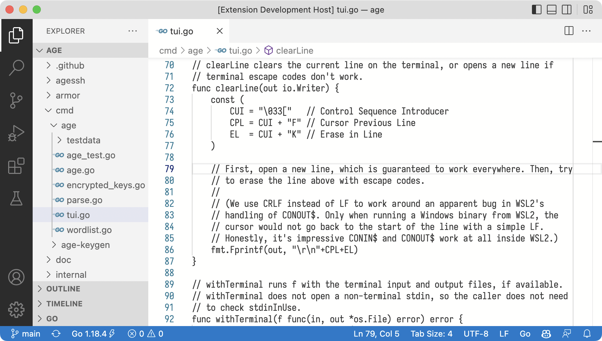
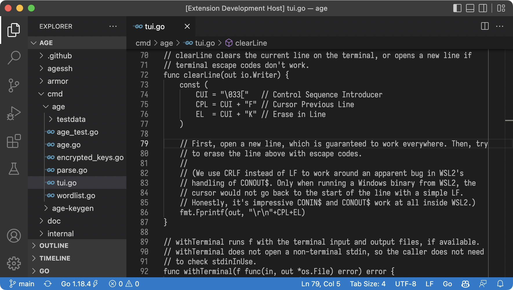

# Frank
Frank is a VS Code theme without syntax highlighting.

## Installation
Install the Frank extension using the VS Code Extension Marketplace. The
extension contains both the Frank and Frank Dark themes. Then, disable colored
brackets by setting `editor.bracketPairColorization.enabled` to `false`.

See the VS Code [themes guide][0] and [settings guide][1] if you need more
detailed instructions.

## Examples
Frank is a light theme, and Frank Dark is a dark theme. The two themes inherit
from VS Code's default Light and Dark themes respectively.

[0]: https://code.visualstudio.com/docs/getstarted/themes
[1]: https://code.visualstudio.com/docs/getstarted/settings